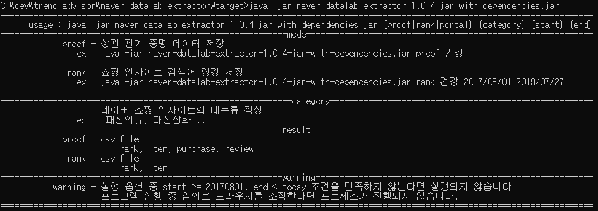

# naver data lab extractor
## 0. 단어 정리
<pre>
    * 장사는 타이밍
        * 포털 사이트 검색어 트렌드를 분석하여 온라인 스토어의 운영에 도움이 될 만한 정보를 제공하는 빅데이터 서비스
</pre>
## 1. 목적
<pre>
"장사는 타이밍"에 활용할 검색어 수집 프로그램을 개발한다. 
</pre>
## 2. 기능
<pre>
* naver 쇼핑 인기 검색어 순위 수집
    * 카테고리
    * 날짜
    * 성별
    * 연령
* auction 판매, 리뷰 데이터 수집
</pre>
## 3. 기술 스택
<pre>
* language
    * java 1.8.0_202
* dependency
    * selenium
    * jsoup
</pre>     
## 4. 개발시 주의사항
<pre>
* selenium을 활용하더라도 block의 위험이 있으니 interval 설정 필수
* 이해하기 쉽게 코드 작성하기
</pre>

## 5. 기타
### 5.1 usage

