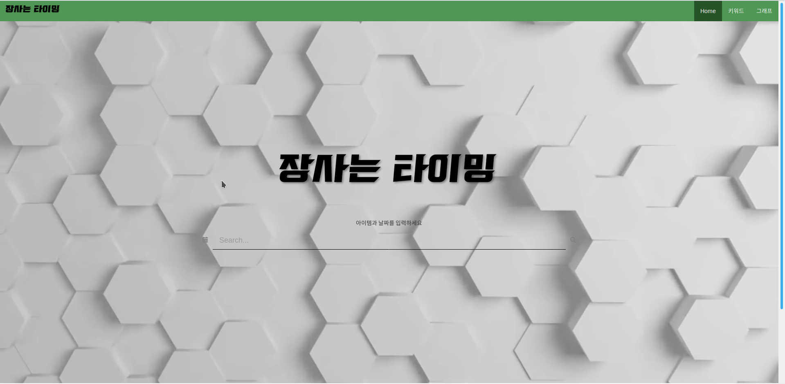

### 로컬에서 장고 실행방법

#### 아나콘다가 설치되어 있어야 합니다.

0. 윈도우에서는 cmd, 리눅스 혹은 맥 환경에서는 shell로 실행시킵니다.

1. 장고 프레임워크를 사용하기 위한 가상환경 세팅 및 실행법 입니다.  
   `web-project` 폴더로 이동합니다.  
   아나콘다 가상환경을 새롭게 구성하고 싶다면 `conda env create -f conda_requirements.txt` 이후 conda activate djangoenv로 가상환경 실행  
   본인의 아나콘다 가상환경에서 구성하고 싶다면 `conda activate '가상환경이름'`으로 본인의 가상환경 실행 후 `pip install -r pip_requirements.txt`로 필요 패키지 설치
   
2. 다음 명령어로 로컬 서버를 실행시킵니다.  
   `web-develop/rollingstone`으로 이동  
   리눅스(맥) 환경에서는 `python3 manage.py runserver`  
   윈도우 환경에서는 `python manage.py runserver`  
   디폴트 포트번호는 8000 입니다만 본인의 포트번호가 다르게 설정되어있다면 실행이 안될 수도 있습니다.  
   그럴 경우에는 리눅스(맥) `python3 manage.py runserver 8000` / 윈도우 `python manage.py runserver 8000`으로 실행해보십시오.  
   서버가 실행되고 있는동안은 shell 혹은 cmd 창을 끄지마십시오.  
   
3. 다음은 웹 브라우저에서 실행법입니다.  
   웹 브라우저를 실행합니다.  
   주소창에 `localhost:8000` 혹은 `127.0.0.1:8000`을 작성하고 엔터를 누릅니다.  
   다음과 같은 화면이 나오면 정상작동되는 것 입니다.  
     
   ##### 추천 웹 브라우저는 크롬, 파이어폭스, 엣지 입니다. / 인터넷 익스플로러에서는 제대로 작동되지 않을 수 있음
   

### 2019 / 08 / 13 장고 환경

<pre>
데이터베이스를 제외한 기본 웹 환경 구성완료  
Chart의 데이터를 views.py에서 불러올 수 있음  
bert 모델의 output값을 데이터에 넣어야함
</pre>

===========================================

### 2019 / 08 / 03 웹 개발 시작

#### 환경요소
<pre>
1. 웹 프레임워크 : 장고(Django)  
2. 데이터베이스 : 미정
</pre>
#### 프론트 구현
<pre>
1. 개발 완료 - 동영상 배경화면(동영상 교체 필요), 상단 메뉴, 검색창  
2. 예정 - 아이템 트랜드 랭크 및 그래프
</pre>
#### 기능 구현
<pre>
1. 예정 - 검색, 학습 데이터 데이터베이스에 삽입
</pre>
